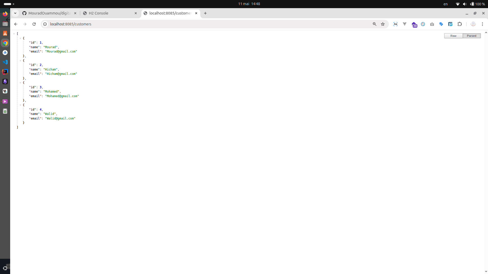
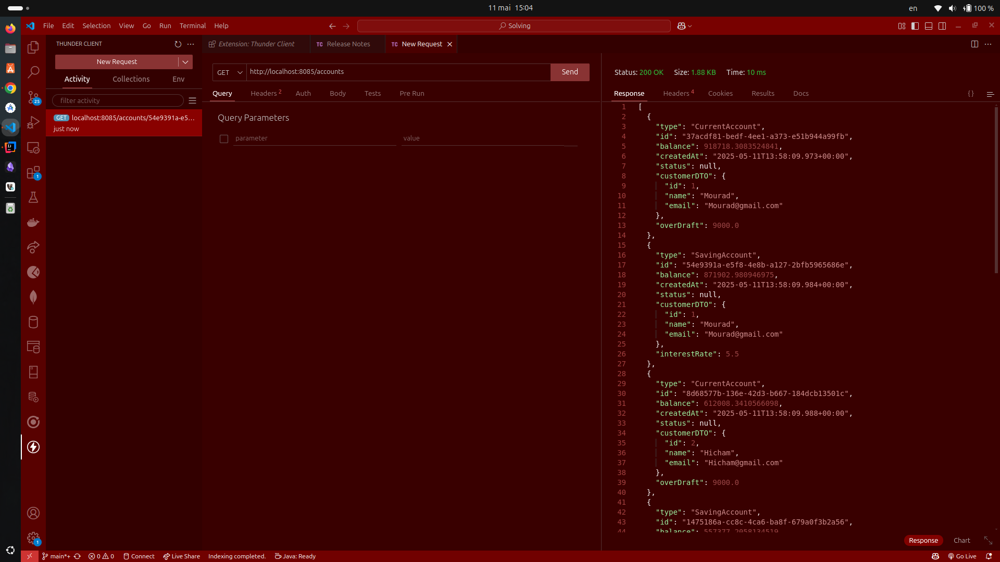
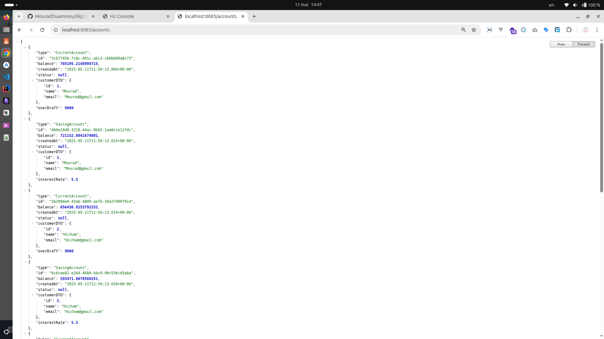
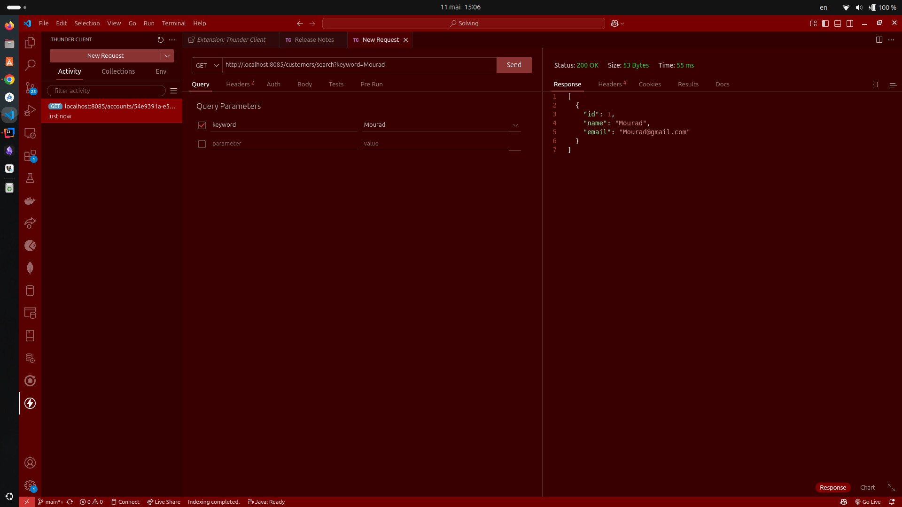
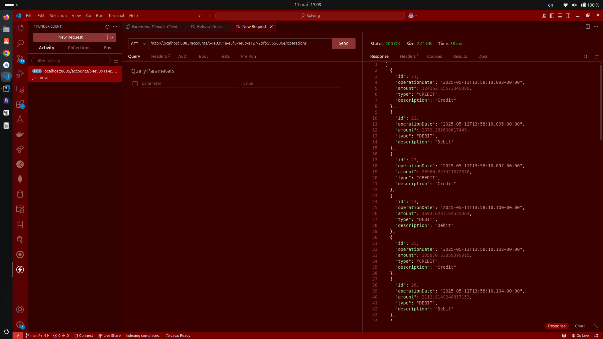

Projet JEE Spring Angular JWT - Digital Banking
===============================================

Réalisé par : OUAMMOU Mourad
----------------------------

Description du projet
---------------------

Une application de gestion de comptes bancaires avec les fonctionnalités suivantes :

*   Gestion des clients et de leurs comptes bancaires
*   Deux types de comptes : Comptes courants et comptes épargnes
*   Opérations de type DEBIT ou CREDIT sur les comptes
*   Authentification sécurisée avec JWT

Architecture technique
----------------------

*   Backend : Spring Boot (Spring Data JPA, Spring Security)
*   Authentification : JWT (JSON Web Token)
*   Base de données : Relationnelle (configurable H2)

Entités JPA
-----------

1.  **Customer** : Représente un client de la banque
2.  **BankAccount** : Classe parente abstraite pour les comptes bancaires
3.  **SavingAccount** : Compte épargne (hérite de BankAccount)
4.  **CurrentAccount** : Compte courant (hérite de BankAccount)
5.  **AccountOperation** : Représente une opération (débit/crédit) sur un compte

Fonctionnalités implémentées
----------------------------

### Gestion des clients

*   Lister tous les clients : `GET /customers`
*   Rechercher un client par ID : `GET /customers/{id}`
*   Créer un nouveau client : `POST /customers`
*   Modifier un client : `PUT /customers/{id}`
*   Supprimer un client : `DELETE /customers/{id}`

### Gestion des comptes

*   Lister tous les comptes : `GET /accounts`
*   Obtenir un compte par ID : `GET /accounts/{id}`
*   Créer un nouveau compte : `POST /accounts`
*   Consulter les opérations d'un compte : `GET /accounts/{id}/operations`

Tests des web services
----------------------

Les web services ont été testés avec Thunder Client. Voici les captures d'écran des tests :

### Exemples de requêtes testées

#### Liste des clients

Endpoint: `http://localhost:8085/customers`

#### Test avec Thunder Client

#### Liste des comptes

Endpoint: `http://localhost:8085/accounts`

#### Recherche de client par ID

Endpoint: `http://localhost:8085/customers/{id}`

#### Opérations d'un compte

Endpoint: `http://localhost:8085/accounts/{id}/operations`

